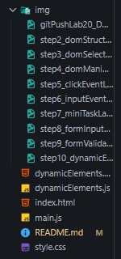

# Лабораторная работа №20: Работа с DOM и событиями в JavaScript

## Основная информация
**ФИО:** Ханов Владислав Вячеславович  
**Группа:** ИСП-231  
**Дата:** 19.03.2026

## Описание
В ходе данной лабораторной работы мы изучили основы работы с DOM и событиями в JavaScript. Освоили методы поиска элементов, изменения их содержимого и стилей, а также обработали различные события пользователя. В результате работы создан интерактивный список с динамическим добавлением и удалением элементов.

## Структура проекта

## Сравнение с C# WinForms

### Как искать элементы
**C#:** `Button btn = this.Controls["button1"];`  
**JS:** `const btn = document.getElementById("button1");`

### Как менять текст
**C#:** `label1.Text = "Новый текст";`  
**JS:** `label.textContent = "Новый текст";`

### Как обрабатывать клики
**C#:** `button1.Click += Button1_Click;`  
**JS:** `button.addEventListener("click", () => {});`

### Как создавать элементы
**C#:** `Button btn = new Button(); panel.Controls.Add(btn);`  
**JS:** `const btn = document.createElement("button"); panel.appendChild(btn);`

## Главные отличия
- **C# компилируется**, JS интерпретируется
- **C# строгая типизация**, JS динамическая
- **C# только под Windows**, JS в любом браузере
- **C# есть визуальный дизайнер**, JS всё руками

## Итог
Задачи одни и те же, но подходы разные. JS удобен для веба, C# для десктопа.
